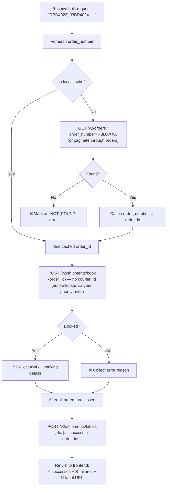

# AutoShip — Final Implementation Plan

## Confirmed Decisions

| Decision | Answer |
|----------|--------|
| **Order ID in QR** | `#RBDXXXX` (Shopify order number, which is `order_number` in NimbusPost) |
| **Tech Stack** | TypeScript + React (Vite) + Node.js (Express) |
| **Architecture** | PWA on phone (scanning) + same web app on desktop (labels/mgmt) + Express backend |
| **Courier Selection** | Auto-allocate — NimbusPost uses your preset courier priority rules (Delhivery Surface → Bluedart → Xpressbees → etc.) |
| **Users** | 2-3 people, need basic login/auth |
| **Label Printing** | Both phone and desktop — merged PDF download |
| **QR Content** | Just the order number, nothing else (e.g., `RBD4023`) |

---

## Architecture

```
┌──────────────────────────────────────────────────────────────┐
│                    PHONE (PWA - Chrome)                      │
│  ┌────────────────────────────────────────────────────────┐  │
│  │  React App (Vite + TypeScript)                         │  │
│  │  • QR Scanner (camera API via html5-qrcode)           │  │
│  │  • Scanned order list (local state)                   │  │
│  │  • "Bulk Ship" → POST /api/ship-bulk                  │  │
│  │  • Results + Label PDF download                       │  │
│  └────────────────────────────────────────────────────────┘  │
│                                                              │
│                    DESKTOP (Browser)                         │
│  ┌────────────────────────────────────────────────────────┐  │
│  │  Same React App                                        │  │
│  │  • Dashboard / history view                           │  │
│  │  • Manual order entry (type order numbers)            │  │
│  │  • Label download + print                             │  │
│  │  • Settings / user management                         │  │
│  └────────────────────────────────────────────────────────┘  │
└──────────────────────────────────┬───────────────────────────┘
                                   │ HTTPS
                                   ▼
┌──────────────────────────────────────────────────────────────┐
│              EXPRESS BACKEND (Node.js + TypeScript)          │
│                                                              │
│  /api/auth/login          → JWT-based simple auth           │
│  /api/orders/lookup       → Resolve order_number → order_id │
│  /api/ship-bulk           → Book N orders + return results  │
│  /api/labels              → Fetch merged label PDF          │
│  /api/history             → Past shipping batches           │
│                                                              │
│  ┌──────────────────┐  ┌──────────────────────────────────┐ │
│  │ NimbusPost API   │  │ SQLite / JSON file               │ │
│  │ Client (axios)   │  │ • Users (2-3 accounts)           │ │
│  │ • API key pair   │  │ • Shipping history               │ │
│  │   stored in .env │  │ • order_number → order_id cache  │ │
│  └──────────────────┘  └──────────────────────────────────┘ │
└──────────────────────────────────┬───────────────────────────┘
                                   │ HTTPS
                                   ▼
┌──────────────────────────────────────────────────────────────┐
│              NimbusPost API v2                               │
│              https://api-v2.nimbuspost.com                   │
└──────────────────────────────────────────────────────────────┘
```

---

## The Core Flow — What Happens Under the Hood

### Step 1: Scan (Phone Only)

```
User scans QR → phone camera reads "RBD4023"
                → App strips "#" if present
                → Checks duplicate against local list
                → Adds to scanned list (in React state)
                → Plays success beep
                → Counter: "23 orders scanned"
```

**No API calls during scanning.** Pure local. Fast.

### Step 2: Bulk Ship (The Big Button)

When user clicks "SHIP ALL", one `POST /api/ship-bulk` call to our backend with:
```json
{
  "orderNumbers": ["RBD4023", "RBD4024", "RBD4025", ...]
}
```

The backend then does this for each order:



### Step 3: Results + Labels

```
Frontend receives:
{
  "shipped": [
    { "orderNumber": "RBD4023", "awb": "AWB123...", "courier": "Delhivery Surface DT", "cost": 75 },
    ...
  ],
  "failed": [
    { "orderNumber": "RBD4030", "error": "Order not found in NimbusPost" },
    { "orderNumber": "RBD4035", "error": "No serviceable courier available" },
    ...
  ],
  "labelUrl": "https://labels.nimbuspost.com/bulk/abc.pdf",
  "totalShipped": 47,
  "totalFailed": 3
}
```

User sees:
- ✅ **47 shipped** — with AWB numbers and courier names
- ❌ **3 failed** — with specific error reasons per order
- 📄 **"Download All Labels"** button → opens/downloads the merged PDF
- 🖨️ Can print directly (works on both phone and desktop)

---

## Order Number → Order ID Resolution

> [!IMPORTANT]
> This is the trickiest part. NimbusPost's `POST /v2/shipments/book` needs their internal `order_id`, but your QR code has the Shopify `order_number`.

### Strategy: List + Filter + Cache

The NimbusPost `GET /v2/orders` API description says:
> *"Filters pass through to the order-service list contract via query string."*

This means **undocumented query filters likely work** — including `order_number`. We will:

1. **First attempt:** `GET /v2/orders?order_number=RBD4023` — if NimbusPost supports this filter, it returns the exact order with its `order_id`. Fast, one call per order.

2. **Fallback if filter doesn't work:** Pull orders in batches (`GET /v2/orders?status=created&limit=100&page=1,2,3...`), find matches by `order_number` client-side, and cache the mapping.

3. **Cache layer:** After first resolution, store `RBD4023 → ORD-123` in SQLite/JSON so we never look it up twice.

> [!NOTE]
> When we start building, the first thing we'll do is test which query filters NimbusPost actually accepts. This determines the speed of the lookup step.

---

## Project Structure

```
d:\13_AutoShip\
├── package.json                    # Root workspace
├── .env                            # NIMBUS_API_KEY, NIMBUS_API_SECRET, JWT_SECRET
│
├── server/                         # Express backend
│   ├── package.json
│   ├── tsconfig.json
│   ├── src/
│   │   ├── index.ts                # Express app entry
│   │   ├── config.ts               # Env vars + constants
│   │   ├── middleware/
│   │   │   └── auth.ts             # JWT auth middleware
│   │   ├── routes/
│   │   │   ├── auth.routes.ts      # POST /api/auth/login
│   │   │   ├── orders.routes.ts    # GET /api/orders/lookup/:orderNumber
│   │   │   ├── shipping.routes.ts  # POST /api/ship-bulk, POST /api/labels
│   │   │   └── history.routes.ts   # GET /api/history
│   │   ├── services/
│   │   │   ├── nimbus.service.ts   # NimbusPost API client (axios)
│   │   │   ├── shipping.service.ts # Bulk ship orchestration logic
│   │   │   └── cache.service.ts    # order_number → order_id cache
│   │   └── types/
│   │       └── index.ts            # Shared TypeScript types
│   └── data/
│       ├── users.json              # Simple user store (2-3 users)
│       └── history.json            # Shipping batch history
│
├── client/                         # React frontend (Vite)
│   ├── package.json
│   ├── tsconfig.json
│   ├── vite.config.ts
│   ├── index.html
│   ├── public/
│   │   ├── manifest.json           # PWA manifest
│   │   ├── sw.js                   # Service worker (offline scanning)
│   │   └── icons/                  # PWA icons
│   └── src/
│       ├── main.tsx                # React entry
│       ├── App.tsx                 # Router + layout
│       ├── index.css               # Global styles + design system
│       ├── api/
│       │   └── client.ts           # Axios client to our backend
│       ├── hooks/
│       │   ├── useScanner.ts       # QR scanning hook
│       │   └── useAuth.ts          # Auth context/hook
│       ├── pages/
│       │   ├── LoginPage.tsx       # Simple login
│       │   ├── ScanPage.tsx        # QR scanner + scanned list
│       │   ├── ShipPage.tsx        # Review + "Ship All" + results
│       │   ├── HistoryPage.tsx     # Past batches
│       │   └── SettingsPage.tsx    # Account settings
│       ├── components/
│       │   ├── Scanner.tsx         # Camera QR reader component
│       │   ├── OrderList.tsx       # Scanned orders list
│       │   ├── ShipResults.tsx     # Success/error results
│       │   ├── Navbar.tsx          # Top nav (responsive)
│       │   └── ProtectedRoute.tsx  # Auth guard
│       └── utils/
│           ├── sounds.ts           # Beep/buzzer audio
│           └── validators.ts       # Order number validation
│
└── shared/                         # Shared types between client & server
    └── types.ts
```

---

## NimbusPost API Endpoints Used

| Our Endpoint | NimbusPost API | When |
|-------------|---------------|------|
| `POST /api/ship-bulk` | `GET /v2/orders` (lookup) | Resolving order_number → order_id |
| `POST /api/ship-bulk` | `POST /v2/shipments/book` (per order) | Booking each order (auto-courier) |
| `POST /api/ship-bulk` | `POST /v2/shipments/labels` | Generating merged label PDF |
| `POST /api/ship-bulk` | `POST /v2/shipments/pickup` (optional) | Requesting courier pickup |
| `GET /api/orders/lookup/:num` | `GET /v2/orders` | Single order validation |

### Auto-Courier Allocation

AutoShip pins `courier_id` in each `POST /v2/shipments/book` request and tries the following services sequentially until one succeeds:

```
Your priority rules (set in NimbusPost dashboard):
1. Delhivery Air
2. Bluedart Brand Air
3. Bluedart Brand
4. Delhivery Surface DT_Stressed
5. Delhivery Surface DT
```

The first successful booking wins. If all five services reject the shipment, AutoShip marks that order as failed and records every attempt in the job log.

---

## Auth System (Simple)

Since it's just 2-3 team members:

- **Users stored in a JSON file** (or SQLite) — no need for a full database
- **JWT tokens** — login once, token valid for 7 days
- **Password hashing** with bcrypt
- **No signup flow** — you create user accounts manually (or via a setup script)

```typescript
// users.json
[
  { "id": 1, "username": "admin", "passwordHash": "...", "role": "admin" },
  { "id": 2, "username": "packer1", "passwordHash": "...", "role": "packer" }
]
```

Roles:
- **admin** — can ship, view history, manage settings
- **packer** — can scan and ship only

---

## QR Code Sticker

The QR code will contain just the order number text:

```
QR Code Data: "RBD4023"
```

- No prefix, no URL scheme — just the plain order number
- App validates it matches the pattern `RBD` followed by digits
- If someone scans a random QR code (like a URL), the app rejects it

### Validation regex:
```typescript
const ORDER_PATTERN = /^#?RBD\d+$/i;
// Matches: RBD4023, #RBD4023, rbd4023
// Rejects: https://google.com, random text, etc.
```

---

## Edge Cases & Error Handling

| Scenario | Handling |
|----------|---------|
| **Duplicate scan** | Red flash + "Already scanned" buzzer. Order not added twice. |
| **Invalid QR** | Red flash + "Not a valid order number" toast |
| **Order not found in NimbusPost** | Marked as ❌ in results: "Order RBD4023 not found" |
| **Order already shipped** | Marked as ⚠️ in results: "Already booked (AWB: XYZ)" |
| **Order cancelled** | Marked as ❌: "Order was cancelled" |
| **No serviceable courier** | Marked as ❌: "No courier available for pincode XXXXXX" |
| **Rate limit (429)** | Auto-retry with backoff, progress shows "Retrying..." |
| **Network failure mid-batch** | Save partial progress, show "Resume" button |
| **Insufficient wallet** | Show NimbusPost error: "Insufficient balance" |
| **Partial success** | Split results: ✅ shipped + ❌ failed with per-order reasons |

---

## Concurrency Strategy for Bulk Booking

For 50 orders, booking one-by-one would take ~30-50 seconds. Instead:

```
Concurrency: 5 parallel requests at a time
50 orders ÷ 5 parallel = 10 batches
~200ms per request = ~2 seconds per batch
Total: ~4-6 seconds for 50 orders + 1 label call

With retry on 429: add ~2-3 seconds worst case
Total: 5-10 seconds for 50 orders
```

Progress bar on frontend: `Shipping 23/50...`

---

## Tech Stack Details

### Frontend
| Library | Purpose |
|---------|---------|
| **React 18** | UI framework |
| **Vite** | Build tool + dev server |
| **TypeScript** | Type safety |
| **React Router v6** | Page routing |
| **html5-qrcode** | Camera-based QR scanning |
| **axios** | HTTP client |
| **react-hot-toast** | Toast notifications |
| **vite-plugin-pwa** | PWA support (installable, offline) |

### Backend
| Library | Purpose |
|---------|---------|
| **Express** | HTTP server |
| **TypeScript** | Type safety |
| **axios** | NimbusPost API client |
| **jsonwebtoken** | JWT auth |
| **bcrypt** | Password hashing |
| **better-sqlite3** or **lowdb** | Lightweight data storage |
| **p-limit** | Concurrency control for bulk booking |
| **dotenv** | Environment variables |
| **cors** | CORS headers for frontend |

---

## Build Phases

### Phase 1 — Core MVP (Ship-by-Scan)
> Get the core scanning → shipping → labels flow working end-to-end.

- [ ] **Backend:** Express server setup, NimbusPost API client, `.env` config
- [ ] **Backend:** `POST /api/ship-bulk` — resolve order numbers, book, return results + label URL
- [ ] **Backend:** Order number → order ID resolution (test which NimbusPost filters work)
- [ ] **Frontend:** Login page (simple JWT auth)
- [ ] **Frontend:** Scan page — QR scanner + scanned order list + duplicate rejection
- [ ] **Frontend:** Ship page — "Ship All" button, progress bar, results (success/error split)
- [ ] **Frontend:** Label download button (opens merged PDF)
- [ ] **PWA:** Manifest + service worker for installability

### Phase 2 — Polish & UX
> Make it fast and pleasant to use.

- [ ] Audio feedback (success beep, error buzzer, completion chime)
- [ ] Vibration feedback on phone
- [ ] Manual order entry (type order number, for desktop or when QR won't scan)
- [ ] Remove orders from scanned list (swipe on mobile, delete button on desktop)
- [ ] Responsive design polish (works great on both phone and desktop)
- [ ] "Retry Failed" button for partially failed batches
- [ ] Real-time counter with visual progress

### Phase 3 — History & Management
> Track what's been shipped and by whom.

- [ ] Shipping batch history (who shipped, when, how many, success rate)
- [ ] History page with filters (by date, by user)
- [ ] User management (admin can add/remove packers)
- [ ] Settings page (view API connection status, account info)

### Phase 4 — Power Features (Future)
> Nice-to-haves for later.

- [ ] Auto-trigger pickup request after bulk shipping
- [ ] QR code sticker generator (generate + print stickers from within AutoShip)
- [ ] Dashboard with daily/weekly shipping analytics
- [ ] Offline scanning with background sync when back online
- [ ] Webhook integration for real-time tracking updates
- [ ] Export shipping data to CSV/Excel

---

## Deployment Options

| Option | Monthly Cost | Notes |
|--------|-------------|-------|
| **Vercel (frontend) + Railway (backend)** | ₹0 | Both have free tiers. Easiest. |
| **Single VPS (DigitalOcean/Hostinger)** | ₹300-500 | Both frontend + backend on one server |
| **Vercel (frontend) + Vercel Serverless (backend)** | ₹0 | Can use Vercel API routes, but less control |
| **Self-hosted (your own machine)** | ₹0 | Free but need to keep machine running |

**Recommended for MVP:** Vercel (free) for frontend + Railway (free) for backend. Zero cost to start.

---

## Remaining Open Questions

> [!IMPORTANT]
> ### 1. Order Number Pattern Confirmation
> Your order numbers always start with `RBD` followed by digits (e.g., `RBD4023`)? Are there any other patterns like `RBD-4023` or `RBDS4023` or different prefixes we should handle?

> [!IMPORTANT]
> ### 2. Sticker Printing
> Who/what generates the current stickers (the white label with the order number)? Is it:
> - A Shopify app that prints packing slips?
> - A thermal label printer with custom software?
> - Manual writing?
> 
> Asking because if we know the tool, we can potentially add QR code generation into your existing sticker workflow rather than building a separate sticker printer.

> [!IMPORTANT]
> ### 3. Database Choice
> For 2-3 users and shipping history, we can use:
> - **SQLite** (lightweight file-based database, zero setup) — recommended
> - **JSON files** (even simpler but less queryable)
> - **PostgreSQL/MySQL** (overkill for this scale)
> 
> I'd go with SQLite unless you have a preference.

---

## Summary

**What we're building:** A TypeScript React + Node.js web app where you scan QR codes on your phone to collect order numbers, hit one button to bulk-ship them all through NimbusPost, and download/print the labels — on either your phone or desktop.

**What makes it work:** NimbusPost's `POST /v2/shipments/book` (auto-allocates courier from your priority rules when you omit `courier_id`) + `POST /v2/shipments/labels` (merges all labels into one PDF).

**Cost:** ₹0/month on free hosting tiers.

**Time to build:** Phase 1 (working MVP) in ~1 week, Phase 2 (polished) in ~1 more week.
