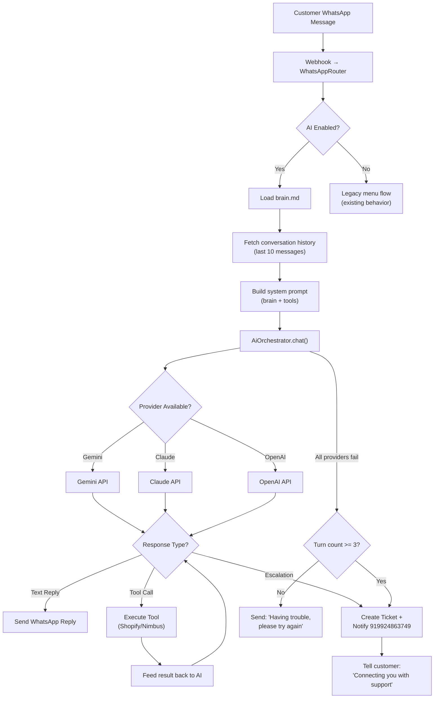

# AI Agent Integration for AutoShip WhatsApp Support

Replace the current menu-driven WhatsApp bot with an AI-powered agent that understands customer messages in natural language, resolves issues using Shopify & NimbusPost APIs, and escalates to a human when it cannot help.

## User Review Required

> [!IMPORTANT]
> **API Keys Required**: You'll need to add API keys for **at least one** of Gemini, Claude, or ChatGPT to the `.env` file. The system will use the first available provider as the primary and fall through to the others if it fails.

> [!IMPORTANT]
> **Fallback Phone Number**: When the AI exhausts its retry limit or cannot resolve an issue, the conversation will be forwarded to `+91 99248 63749` via WhatsApp. Please confirm this is the correct number.

> [!WARNING]
> **Breaking Change**: The current menu-driven flow (reply 1–6) will be **completely removed**. All existing menu options (order confirmation, address change, tracking, dispatch status, delivery failure, refund/return) will now be handled by the AI agent directly from the customer's free-text message. The `sendMenu()` function and numbered-reply routing will be eliminated.

## Open Questions

> [!IMPORTANT]
> **Brain File Location**: Where should the brain/rules file live? I'm proposing `server/data/brain.md` — a Markdown file containing all rules, tone, escalation triggers, and allowed actions the AI agent can perform. Is this acceptable, or do you want it in a different location?

> [!IMPORTANT]
> **AI Retry Limit**: Before escalating to the human phone number, how many AI attempts should be allowed per conversation? I'm proposing **3 AI turns** — if the AI cannot resolve the issue in 3 back-and-forth exchanges, it escalates. Is this reasonable?

> [!IMPORTANT]
> **Provider Priority**: Which AI provider should be the **primary**? My proposal:
> 1. **Gemini** (primary) — best cost/performance for this kind of task
> 2. **Claude** (fallback 1)  
> 3. **ChatGPT** (fallback 2)
> 
> If the primary fails (rate limit, API error), we automatically try the next one.

---

## Proposed Changes

### Component 1: AI Provider Layer

A new module that abstracts over all three LLM providers with a unified interface, automatic failover, and conversation history management.

#### [NEW] [ai-providers.ts](file:///d:/13_AutoShip/server/src/ai-providers.ts)

Creates a unified AI client with the following design:

```typescript
// Unified interface
interface AiProvider {
  name: string;
  chat(messages: ChatMessage[], systemPrompt: string): Promise<string>;
}

// Three concrete implementations
class GeminiProvider implements AiProvider { ... }  // @google/generative-ai
class ClaudeProvider implements AiProvider { ... }  // @anthropic-ai/sdk
class OpenAiProvider implements AiProvider { ... }  // openai

// Orchestrator with automatic failover
class AiOrchestrator {
  private providers: AiProvider[];
  
  constructor(config: AiConfig) {
    // Build ordered list of available providers based on which API keys exist
  }
  
  async chat(messages: ChatMessage[], systemPrompt: string): Promise<string> {
    // Try primary → fallback1 → fallback2
    // Throws AiExhaustedError if all fail
  }
}
```

**Key design decisions:**
- Each provider wraps its native SDK with a common `ChatMessage[]` interface (`{ role: "user" | "assistant" | "system", content: string }`)
- Failover is per-request: if Gemini returns a 429, the same request immediately retries on Claude
- Token limits are set conservatively (max 500 output tokens per reply) to control cost
- Conversation history is trimmed to the last 10 messages to stay within context windows

---

### Component 2: Brain / Rules File

A Markdown file containing all business rules, personality, escalation triggers, and available actions. The AI system prompt is built dynamically from this file.

#### [NEW] [brain.md](file:///d:/13_AutoShip/server/data/brain.md)

```markdown
# AutoShip AI Support Agent — Brain

## Identity
You are the AI customer support agent for Diorin Design (brand selling via Shopify).
You handle WhatsApp messages from customers about their orders.

## Tone
- Friendly, professional, helpful
- Use English with light Hindi phrases when the customer writes in Hindi/Hinglish
- Keep replies concise (3-5 lines max)
- Use relevant emojis sparingly (✅, 📦, 🚚, etc.)

## Available Tools/Actions
You can call these functions to help customers:
1. **lookup_order(order_number)** — Get order details from Shopify (items, amount, status, address)
2. **track_order(order_number)** — Get tracking/AWB from NimbusPost (status, location, ETA, courier)
3. **check_dispatch(order_number)** — Check if order has been shipped or is still processing
4. **lookup_by_phone(phone)** — Find orders by customer phone number
5. **update_address(order_number, new_address)** — Update shipping address (only for unshipped orders)
6. **create_ticket(phone, order_number, category, description)** — Escalate to human support

## Escalation Rules
ALWAYS escalate (create ticket + notify human) when:
- Customer asks for a refund
- Customer says item is missing or wrong
- Customer wants to return an item
- Customer mentions legal action or consumer court
- You cannot find their order after 2 attempts
- The customer is angry/frustrated after your first response
- Any address change on an order already in transit
- You've had 3 back-and-forth exchanges without resolving

## Rules
- NEVER promise a refund — only escalate refund requests
- NEVER share internal system details or API responses directly
- ALWAYS verify the order belongs to the WhatsApp number before sharing details
- If you don't know something, say so and escalate — never make up information
- For order confirmation: share items, total, shipping address, courier if available
- For tracking: share status, AWB, courier, ETA, tracking link if available
- For dispatch delays: check NimbusPost status and give honest timeline
- For delivery failures (NDR): explain the situation and offer re-attempt or RTO options
```

---

### Component 3: AI-Powered WhatsApp Router

Replace the existing menu-driven `WhatsAppRouter` with an AI-driven conversation handler.

#### [MODIFY] [whatsapp-router.ts](file:///d:/13_AutoShip/server/src/whatsapp-router.ts)

**Major changes:**

1. **Remove** the `INTENTS`, `KEYWORDS`, `classifyIntent()` menu system
2. **Remove** the `showMenu()`, `askForOrder()`, `askRefundIssue()` methods
3. **Remove** the state-machine `resume()` with its `waiting_menu`, `waiting_issue`, `waiting_order`, `waiting_pick` steps
4. **Add** an AI-powered `process()` method that:
   - Loads the brain file
   - Fetches conversation history from the database (last 10 messages for this phone)
   - Builds a system prompt from the brain + available tool definitions
   - Sends the customer message + history to the AI
   - Parses the AI response for tool calls (function calling / structured output)
   - Executes any tool calls (Shopify lookups, Nimbus tracking, etc.)
   - Sends the AI's final text reply back to the customer
   - Tracks the AI turn count; if it exceeds the limit, escalates

5. **Keep** the existing helper methods intact but refactor them as AI "tools":
   - `confirmOrder()` → `lookup_order` tool
   - `orderStatus()` → `track_order` tool  
   - `notDispatched()` → `check_dispatch` tool
   - `resolveIdentifier()` → `lookup_by_phone` tool
   - `beginAddressChange()` / `applyAddressUpdate()` → `update_address` tool
   - `refundReturn()` → `create_ticket` tool (always escalate)

6. **Add** escalation to fallback phone number:
   ```typescript
   private async escalateToHuman(phone: string, reason: string) {
     const escalationPhone = this.dependencies.escalationPhone; // "919924863749"
     const summary = `🚨 Customer ${phone} needs human help.\nReason: ${reason}\nPlease check the support dashboard.`;
     await this.dependencies.whatsapp.sendText(escalationPhone, summary);
     await this.send(phone, "I've connected you with our support team. Someone will reach out to you shortly. 🙏");
     await this.dependencies.store.createSupportTicket({...});
   }
   ```

**The AI response flow (pseudocode):**

```
Customer sends message
  → Load brain.md
  → Fetch last 10 messages from wa_messages table for this phone
  → Build system prompt: brain rules + tool definitions
  → Send to AI: system prompt + conversation history + new message
  → AI responds with either:
      a) A direct text reply → send via WhatsApp
      b) A tool call (e.g. lookup_order("#RBD5001")) → execute it, feed result back to AI → AI writes final reply → send
      c) An escalation signal → create ticket + notify human phone + tell customer
  → Increment AI turn counter in conversation context
  → If turn counter >= 3 and still unresolved → auto-escalate
```

---

### Component 4: Database Changes

#### [MODIFY] [store.ts](file:///d:/13_AutoShip/server/src/store.ts)

Add new methods and update existing tables:

1. **New method: `getConversationHistory(phone, limit)`** — Returns the last N messages for a phone number from `wa_messages`, ordered chronologically. This feeds the AI's conversation context.

2. **New method: `incrementAiTurnCount(phone)`** — Tracks how many AI exchanges have happened in the current session. Stored in the `wa_conversations.context` JSON field.

3. **New method: `getAiTurnCount(phone)`** — Reads the current turn count.

4. **Update `wa_messages` table**: Add optional column `ai_provider TEXT` to track which AI provider generated each bot response (useful for debugging and cost tracking).

No new tables needed — we reuse `wa_messages`, `wa_conversations`, and `support_tickets`.

---

### Component 5: Configuration & Environment

#### [MODIFY] [config.ts](file:///d:/13_AutoShip/server/src/config.ts)

Add new config fields:

```typescript
// AI provider API keys
geminiApiKey: process.env.GEMINI_API_KEY || "",
claudeApiKey: process.env.CLAUDE_API_KEY || "",
openaiApiKey: process.env.OPENAI_API_KEY || "",

// AI settings
aiMaxTurns: Number(process.env.AI_MAX_TURNS || 3),
aiPrimaryProvider: process.env.AI_PRIMARY_PROVIDER || "gemini", // "gemini" | "claude" | "openai"

// Escalation
escalationPhone: process.env.ESCALATION_PHONE || "919924863749",

// Brain file path
brainFilePath: process.env.BRAIN_FILE_PATH || path.join(workspaceDirectory, "server", "data", "brain.md"),
```

#### [MODIFY] [.env](file:///d:/13_AutoShip/.env)

Add new environment variables:

```env
# AI Provider API Keys (at least one required)
GEMINI_API_KEY=
CLAUDE_API_KEY=
OPENAI_API_KEY=

# AI Settings
AI_PRIMARY_PROVIDER=gemini
AI_MAX_TURNS=3

# Escalation phone (receives WhatsApp when AI cannot resolve)
ESCALATION_PHONE=919924863749
```

#### [MODIFY] [.env.example](file:///d:/13_AutoShip/.env.example)

Add the same keys with documentation comments.

---

### Component 6: App Wiring

#### [MODIFY] [app.ts](file:///d:/13_AutoShip/server/src/app.ts)

1. **Import** `AiOrchestrator` from the new module
2. **Instantiate** the orchestrator in `createApp()` using config
3. **Pass** the orchestrator + brain file path + escalation phone to `WhatsAppRouter`
4. **Update** `AppConfig` type with the new fields
5. **Add** a new API endpoint `GET /api/settings/ai-status` that returns which AI providers are configured and active

#### [MODIFY] [types.ts](file:///d:/13_AutoShip/server/src/types.ts)

Add new types:

```typescript
export type ChatMessage = { role: "user" | "assistant" | "system"; content: string };
export type AiToolCall = { name: string; arguments: Record<string, unknown> };
export type AiResponse = { text: string; toolCalls?: AiToolCall[] };
```

---

### Component 7: NPM Dependencies

#### [MODIFY] [package.json](file:///d:/13_AutoShip/server/package.json)

Add new dependencies:

```json
"@google/generative-ai": "^0.24.0",
"@anthropic-ai/sdk": "^0.52.0",
"openai": "^5.0.0"
```

---

### Component 8: Client-Side AI Status (Optional)

#### [MODIFY] [App.tsx](file:///d:/13_AutoShip/client/src/App.tsx)

In the `SettingsPage` component, add an "AI Agent" settings card showing:
- Which AI providers are configured (green/red indicators for Gemini, Claude, ChatGPT)
- Primary provider name
- Max turn count before escalation
- Escalation phone number

In the `SupportPage` component, update the chat header to show "AI Agent active" instead of "Bot active" when AI is configured.

---

## Architecture Diagram



---

## Verification Plan

### Automated Tests

```bash
# Run existing tests to ensure no regression
cd d:\13_AutoShip\server && npm test

# Type check
cd d:\13_AutoShip\server && npm run typecheck
```

### Manual Verification

1. **Brain file loads correctly** — Start the server with `npm run dev` and check logs for brain file loading
2. **AI responds to a test message** — Send a WhatsApp message like "Where is my order RBD5001?" and verify the AI:
   - Loads conversation history
   - Calls the `lookup_order` / `track_order` tools
   - Sends a natural-language reply with order details
3. **Escalation works** — Send "I want a refund" and verify:
   - A support ticket is created
   - The escalation phone `919924863749` receives a notification
   - The customer gets a "connecting you with support" message
4. **Provider failover** — Temporarily use an invalid API key for the primary provider and verify it falls back to the secondary
5. **Turn limit** — Have a 3+ turn conversation where the AI can't resolve the issue and verify auto-escalation fires
6. **Settings page** — Check the client settings page shows AI provider status indicators
